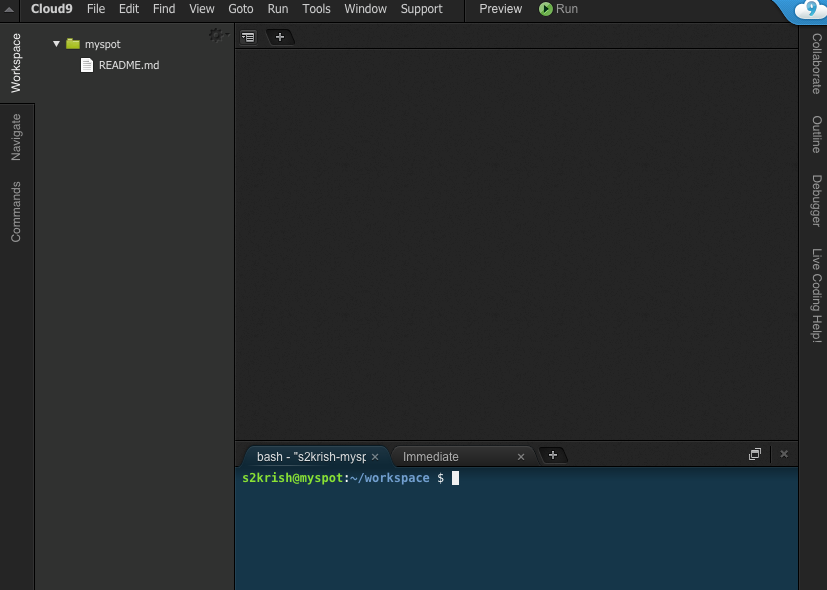

**********************
DAY-1: React Component
**********************

In this fast track tutorial, we'll be building simple Spot training App, a powerful app using React. React is JavaScript library developed and maintained by Facebook and being used both in Facebook and Instagram.

While we'll demonstrate most important features and concept of react, it is not comprehensive react tutirial. This is not what we want and this is also not necessary to get you started on the fast lane. After completing tutorial you will know:

1. Write rich client Applications using React. Something like facebook and instagram.
2. You will fully convinced that React is for "building large applications with data that changes over time" - Facebook
3. You can develop stateful, interactive and reusable UI components
4. You also understand that it is specifically designed to fit sites where there are lot of updates

Roll up sleevs and get start:

(Powerpoint show)

In next four hour we'll be make Application, that runs in Mobile and Desktop, following features:
 - mark (training) spots
 - rate spot (good for pullups, bad for running, ...)
 - describe spots (features, running space, training possibilites), fotos
 - group trainings (I try here tonight @ 10 - who joins?)

1. Development Environment
##########################

Setting of Development is as simple as downloading two JavaScript files (React Starter Kit), browser (Internet Explorer, Firefox, Safari, Chorme or any other) and simple editor like Notepad or TextEdit. However, like in all other tutorials, we recommend to use Could9, referred as c9 hereafter.

So, please signup in `c9.io <https://c9.io>`_ and create an account. Don't worry ... it's free ...

**Why c9?**

c9 is a browser based IDE (Integrated Development Environment) that can be configured to suite your specific need. In our case, we'll be using Ubuntu machine - you just need a browser and an internet connection. 

1.1 c9 dashboard
================

Ok - you have created a c9 account ... great! Now it is time to create a workspace. 
Please login with your c9 account and follow the steps below.

We would recommend that you are using 2 screens - have your c9 browser on one side and this course window on the other.

.. figure:: images/c9-dashboard.png

   *Figure 1.1: c9 dashbaord*

1.2 Create workspace
====================

1. Login with your c9 account and go to the dashboard.
2. Click on **Create a new workspace**.
3. Type **myspot** in workspace name.
4. Click on public.
5. Select **custom** as the template

   .. figure:: images/c9-project-template.png

       *Figure 1.2: Workspace template*

7. Click on Create Workspace button.

This will create new workspace named 'myspot'.

1.2 Workspace Introduction
==========================

So let's check out your online workspace. You have an editor, your own Linux shell and a runtime - that's all you need to develop, test and run your application.

   *Figure 1.3: c9 Workspace*

In above window, you can see:

1. **Run Project**: When you click "Run Project" c9 will start "application server" with your code and you will be able to access and test it in your browser.
2. **Project exporer**: Shows you a list of files and folders of your project.
3. **Bash**: Browser based terminal to run Linux commands. In your c9 environment you have your own little Linux server - you can run commands like your were logged in with ssh.

2. Component
############

Compoment represents a unit UI or set of UIs. In fact, everything is component in React. Let us create our first component, spot name.

1. In your c9 workspace, click on file menu.
2. Click New File
3. Copy and paste following code

   .. code-block:: html
      :linenos:

       <!DOCTYPE html>
        <html>
          <head>
            <meta charset="UTF-8" />
            <title>I created an Event Website using React. Learn #React in 4 hours on http://slash4.de</title>
            
            
          </head>
          <body>
            

            
          </body>
        </html>

4. Save it
5. Click on Run

The project URL is shown in line :code:`Your code is running at https://projectname-username.c9.io`. The part after http (including http). For example, http://myspot-slash4.c9.io is the URL for us, where myevent is the project name and slash4 is your username. Alternatively, you can find your project URL by clicking on preference icon at top-right corner of workspace.

.. note::
    JXS - what is JXS

There are multiple ways to write React compoment - using plain vanilla JavaScript and using JXS. We'll be using JXS all time.

3. Props
########

Props is attribute attribute of compoment, mostly useful to pass value to compoment. 

.. code:: bash

   git checkout -f day-1-step-1

--> code to show how to pass props, pass spot name to compoment in props -->

Here, we have passed the spot name using props. Notice that the props can be accessed within component using this.props

4. Parent and Child Components
##############################

The power and simplicity of React probably lies on it's feature that allow to create reusable compoments. When you make a compoment it can be called from another compoment. The caller is called Parent and the component which is being called is known as Child.

4.1 Adding Spot Review
======================

In our spot app, let us add user review information e.g. good for pullups, bad for running

.. code:: bash

   git checkout -f day-1-step-2

 --> code to show review -->

5. Assignments
##############

1. Add spot description.
2. Add spot address
3. Add list of review, show multiple reviews
4. Add sharethis component